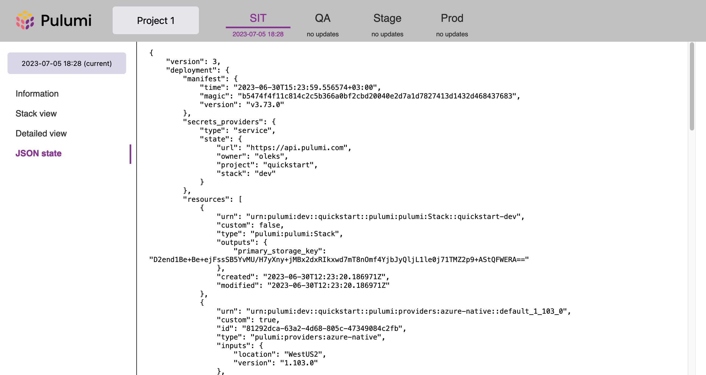

# pulumi-stack-viewer
The static web application to navigate the Pulumi state within your projects and environments.

It may be useful if you don't use Pulumi service with their beautiful UI.


## How to use
Publish Pulumi metadata after the Pulumi deployment. Set up your pipeline to send the data to the storage. 

Short information about the selected state:
<br>

The full stack state overview for the selected state:
<br>


### Configuration

The UI configuration is stored in the `config.json` file in the web application root. The file contains the following properties:

- `projects` - the list of projects with the project key and name,
- `environments` - the list of environments with the environment key and name,
- `defaults` - the project and environment keys that are displayed by default when you open the application.

Example:

```json
{
  "projects": {
    "project-1": "Project 1",
    "project-2": "Project 2"
  },
  "environments": {
    "sit": "SIT",
    "qa": "QA",
    "uat": "UAT",
    "prod": "PROD"
  },
  "defaults": {
    "project": "project-1",
    "environment": "sit"
  }
}
```

Keys are used in the file structure so do not change. Names are displayed in the UI.


### Working with the application

1. Upload the web application to the source folder.
2. Update your pipeline to upload the state to the storage after the Pulumi deployment.

Use the bash scripts from the `scripts` folder. The pre-requisites for them are `pulumi` CLI and `jq` tool.

Let's use the project key `project-1` and the environment key `sit` for the examples below.


#### Local environment

```bash
source ./scripts/upload-local.sh

# Upload the web application
initial_upload_web_application "/source/path/to/app" "/path/to/app"

# Upload the state on every Pulumi deployment
upload_pulumi_stack_state "/path/to/app/state" "project-1" "sit"
```

#### Azure Blog Storage static website

```bash
source ./scripts/upload-azure-storage.sh

# Upload the web application
initial_upload_web_application "storage_account_name" "/local/path/to/web/app"

# Upload the state on every Pulumi deployment
upload_pulumi_stack_state "storage_account_name" "project-1" "sit"
```


#### AWS S3 static website

```bash
source ./scripts/upload-aws-s3.sh

# Upload the web application
...

# Upload the state on every Pulumi deployment
...
```


## License

`pulumi-stack-viewer` is licensed under a MIT license. Please see the [LICENSE](./LICENSE) file for details.


## ToDo
- test on AWS
- add how-to for AWS
- publish to GitHub
